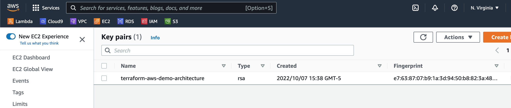
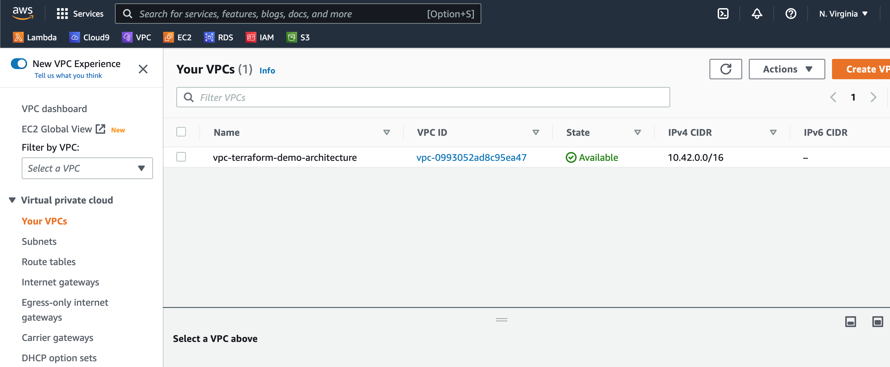
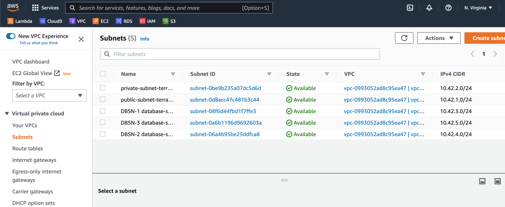
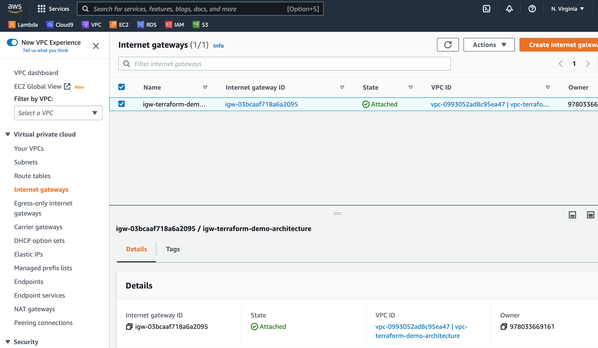
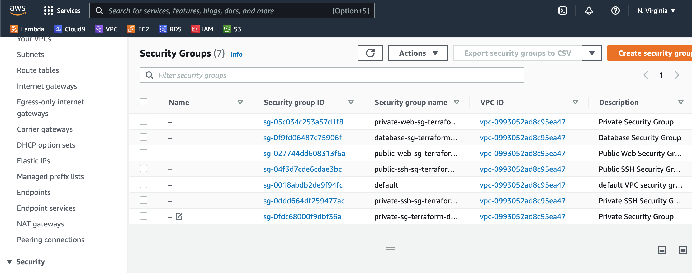
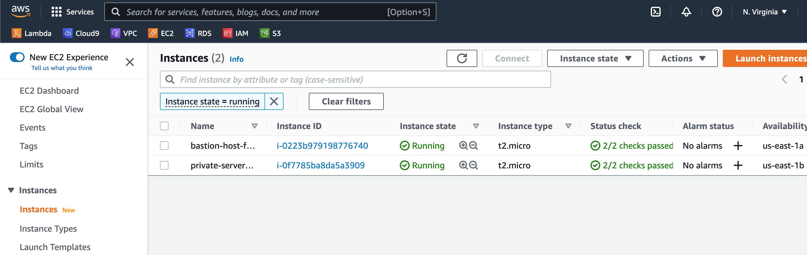
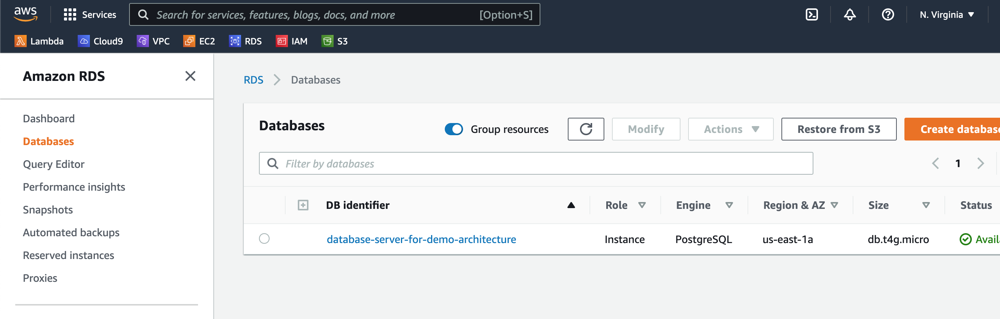
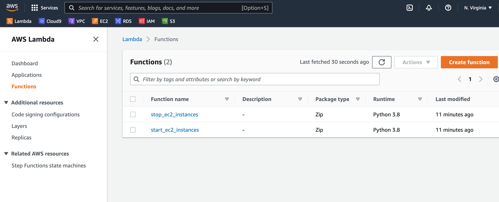

# Terraform AWS Demo Architecture

This repo creates all the required resource to run a secure demo application in the AWS cloud to show a specific use case for a test to get a job.

### KEY PAIR



### VPC



### Subnets



### Route tables


### Internet gateways



### Security groups



### EC2



### RDS



### Lambda



## How to use

### Key pair

```sh
ssh-keygen -t rsa -f .terraform-aws-demo-architecture-key-pair
```

You'll want to forward ssh-agent when connecting to the bastion host. First add the key to ssh-agent `ssh-add .terraform-aws-demo-architecture-key-pair` and connect using `ssh -T ec2-user@<bastion_host_instance_public_ip>`. From there you can ssh into the private instaces without having to copy the key pair onto the bastion host. This is good security practice.

### Destroy

When you're done trying out the technology you can destroy it and you can build it back again with a single command.

```sh
terraform init && terraform destroy -auto-approve
```

### Apply

```sh
terraform init && terraform plan && terraform apply -auto-approve
```

Running the command above should create the infrastructure and output connection details similar to this

```
Apply complete! Resources: 32 added, 0 changed, 0 destroyed.

Outputs:

amazon_linux_id = "ami-0464d49b8794eba32"
aws_region = "us-east-1"
bastion_host_instance_id = "i-04a0dc500549378e8"
bastion_host_instance_public_ip = "54.156.94.240"
database_address = <sensitive>
private_server_instances_id = [
  "i-07c8c2cf12e7a6bcb",
]
private_server_instances_private_ip = [
  "10.42.2.254",
]
ssh_key_pair_name = "terraform-aws-demo-architecture"
```

Login to bastion host from anywhere in the world

```sh
ssh -A ec2-user@<app_bastion_host_instance_public_ip>
```

Login to private servers from bastion host

```sh
ssh ec2-user@<app_private_server_instance_private_ip>
```

## Music

My friend, please checkout the videos `tellmewhatyoulove` uploaded to youtube if you like good music. Have a great day!
https://www.youtube.com/watch?v=7l50SSrqHt8
https://www.youtube.com/channel/UCg4_8m7Dlpi0run1heWvStA/videos

# LICENSE

MIT License

Copyright (c) 2022 ALEKSANDR GORETOY alex@goretoy.com

Permission is hereby granted, free of charge, to any person obtaining a copy
of this software and associated documentation files (the "Software"), to deal
in the Software without restriction, including without limitation the rights
to use, copy, modify, merge, publish, distribute, sublicense, and/or sell
copies of the Software, and to permit persons to whom the Software is
furnished to do so, subject to the following conditions:

The above copyright notice and this permission notice shall be included in all
copies or substantial portions of the Software.

THE SOFTWARE IS PROVIDED "AS IS", WITHOUT WARRANTY OF ANY KIND, EXPRESS OR
IMPLIED, INCLUDING BUT NOT LIMITED TO THE WARRANTIES OF MERCHANTABILITY,
FITNESS FOR A PARTICULAR PURPOSE AND NONINFRINGEMENT. IN NO EVENT SHALL THE
AUTHORS OR COPYRIGHT HOLDERS BE LIABLE FOR ANY CLAIM, DAMAGES OR OTHER
LIABILITY, WHETHER IN AN ACTION OF CONTRACT, TORT OR OTHERWISE, ARISING FROM,
OUT OF OR IN CONNECTION WITH THE SOFTWARE OR THE USE OR OTHER DEALINGS IN THE
SOFTWARE.
